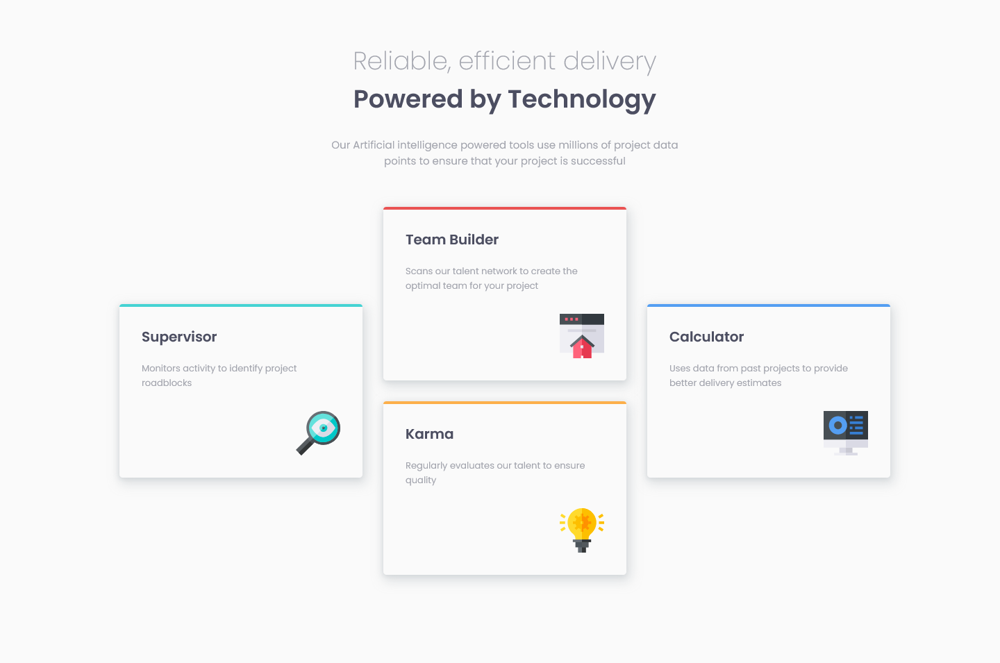

# Frontend Mentor - Four card feature section solution

This is a solution to the [Four card feature section challenge on Frontend Mentor](https://www.frontendmentor.io/challenges/four-card-feature-section-weK1eFYK). Frontend Mentor challenges help you improve your coding skills by building realistic projects. 

## Table of contents

- [Overview](#overview)
  - [The challenge](#the-challenge)
  - [Screenshot](#screenshot)
  - [Links](#links)
- [My process](#my-process)
  - [Built with](#built-with)
  - [What I learned](#what-i-learned)
  - [Continued development](#continued-development)
  - [Useful resources](#useful-resources)
- [Author](#author)

## Overview

### The challenge

Users should be able to:

- View the optimal layout depending on their device's screen size
- See hover states for interactive elements

### Screenshot

### Links

- Solution URL: [HTML Solution](https://github.com/hitmorecode/NFT_preview_card_component/blob/main/index.html)
- Solution URL: [CSS Solution](https://github.com/hitmorecode/NFT_preview_card_component/blob/main/css/style.css)
- Live Site URL: [Live site](https://hitmorecode.github.io/NFT_preview_card_component/)

## My process

### Built with

- Semantic HTML5 markup
- CSS custom properties
- Flexbox

### What I learned

This challenge was a good way to practice using flexbox and position.
Using flexbox and position is very useful once you understand the basics of these concepts.

### Continued development

Using flexbox and position was not so easy to start with, since I'm still new with these concepts. I'll be focusing on these subjects for the coming challenges.

The challenge was to create a NFT card, but I added three more cards to start practicing responsiveness.

### Useful resources

- [CSS-Tricks](https://css-tricks.com/snippets/css/a-guide-to-flexbox/) - This is an amazing article which helped me getting started with flexbox. I'd recommend it to anyone still learning this concept.
- [Colt Steele - Flexbox tutorial](https://www.youtube.com/watch?v=qZv-rNx0jEA) - This video helped me understand flexbox. If you are struggling with flexbox like I did, I recommend this video.
- [Web Dev Simplefied - CSS position](https://www.youtube.com/watch?v=jx5jmI0UlXU) - This tutorial explains how position works.

## Author

- Frontend Mentor - [@hitmorecode](https://www.frontendmentor.io/profile/hitmorecode)